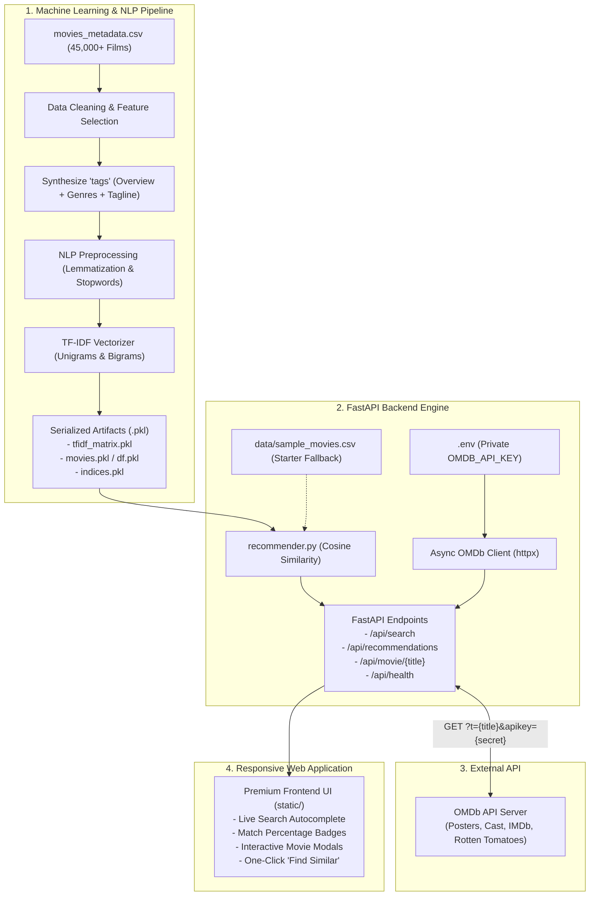

#Live Link - https://movie-recomendation-ml-project.onrender.com

# 🎬 CineMatch — Intelligent Movie Recommendation System

An end-to-end Machine Learning web application that delivers content-based movie recommendations using **Natural Language Processing (NLP)**, **TF-IDF Vectorization**, and **Cosine Similarity**. Recommends mathematically similar films based on narrative themes, genres, and motifs, securely enriched with live metadata, posters, and IMDb ratings from the **OMDb API**.

---

## 🎨 Custom Design System (Green Harmony)

The web application is styled with a custom, tailored 4-shade green palette:

| Color Swatch | Hex Code | Role | Usage |
| :---: | :---: | :--- | :--- |
|  | `#E9F5EA` | **Canvas Mint** | Page background, subtle radial gradients, chip backgrounds |
|  | `#A6D7A8` | **Soft Sage** | Card borders, interactive focus rings, loading shimmers |
|  | `#66BC6A` | **Leaf Emerald** | Similarity percentage pills, active badges, primary accents |
|  | `#145E1A` | **Deep Forest** | Primary headings, buttons, brand symbols, high-contrast text |

---

## 🏛️ System Architecture



---

## 📂 Project Structure

```
Movie recomendation Project/
├── .env                              # Private environment variables (DO NOT COMMIT)
├── .env.example                      # Template for environment configuration
├── .gitignore                        # Git exclusion rules (.env, .venv, artifacts)
├── requirements.txt                  # Production Python dependencies
├── Movie_Recomendation_System.ipynb  # Step-by-step documented ML & NLP notebook
├── build_model.py                    # Reproducible training & artifact generation script
├── recommender.py                    # Inference engine (Cosine similarity calculation)
├── main.py                           # FastAPI application & static file server
├── data/
│   └── sample_movies.csv             # 60 iconic movies for immediate out-of-the-box usage
├── static/
│   ├── index.html                    # Modern HTML5 single-page application
│   ├── style.css                     # Custom CSS with 4-shade green palette
│   └── app.js                        # Client-side autocomplete, rendering, & modals
└── artifacts/                        # Generated serialized models (auto-created upon training)
    ├── movies.pkl
    ├── tfidf_matrix.pkl
    ├── indices.pkl
    └── tfidf.pkl
```

---

## 🚀 Quick Start Guide

### 1. Prerequisites
- Python 3.10+ (Python 3.13 recommended)
- Windows PowerShell or Terminal

### 2. Environment Setup & Dependency Installation

Open PowerShell in the project directory:

```powershell
# Create virtual environment (if not already created)
python -m venv .venv

# Activate virtual environment
.\.venv\Scripts\Activate.ps1

# Install required dependencies
pip install -r requirements.txt
```

### 3. Configure API Credentials

Ensure your `.env` file contains your OMDb API key:

```env
OMDB_API_KEY=c1004ab0
OMDB_BASE_URL=https://www.omdbapi.com/
```

> [!IMPORTANT]
> **Security Guarantee**: Your API key is read **only** by the server-side FastAPI process (`main.py`). It is **never** included in HTTP responses, never rendered into client JavaScript, and `.env` is ignored by `.gitignore` to prevent leakage.

### 4. Run the Application

Start the FastAPI development server:

```powershell
.\.venv\Scripts\python.exe -m uvicorn main:app --reload --port 8000
```

- Open your browser to: **`http://127.0.0.1:8000`**
- Interactive Swagger API documentation: **`http://127.0.0.1:8000/docs`**

---

## 🧠 Training on the Full Dataset (45,000+ Movies)

The application ships with an expanded starter catalog of 60 universally recognized movies in `data/sample_movies.csv`.

To train the model on the full Kaggle dataset (`movies_metadata.csv`):

```powershell
# Run the training pipeline
.\.venv\Scripts\python.exe build_model.py --input "C:\Users\asus\Downloads\movies_metadata.csv" --output artifacts
```

Once completed, the pipeline outputs:
- `artifacts/movies.pkl` (Cleaned movie metadata)
- `artifacts/tfidf_matrix.pkl` (Fitted TF-IDF sparse matrix)
- `artifacts/indices.pkl` (Fast index lookups)

Restart the FastAPI server — it will automatically detect the trained artifacts and scale from 60 movies to the full 45,000+ movie catalog!

---

## 📡 REST API Reference

### 1. System Health & Catalog Status
- **Endpoint**: `GET /api/health`
- **Description**: Returns active catalog size, training source, and OMDb connection status (no secret keys exposed).
- **Example Response**:
  ```json
  {
    "status": "online",
    "catalog_source": "starter catalog (60 movies)",
    "total_movies": 60,
    "omdb_configured": true,
    "cached_titles": 4
  }
  ```

### 2. Title Autocomplete Search
- **Endpoint**: `GET /api/search?q={query}`
- **Description**: Fast prefix-ranked title suggestions with genre previews and rating scores.
- **Example Response**:
  ```json
  {
    "query": "Incep",
    "results": [
      {
        "title": "Inception",
        "genres": ["Science", "Fiction", "Action"],
        "rating": 8.4
      }
    ]
  }
  ```

### 3. Movie Recommendations
- **Endpoint**: `GET /api/recommendations?title={title}&limit={count}`
- **Description**: Calculates cosine similarity across feature vectors and enriches the top $N$ closest films with live OMDb posters, runtimes, and IMDb ratings.
- **Example Response**:
  ```json
  {
    "seed": "Inception",
    "count": 6,
    "recommendations": [
      {
        "title": "The Matrix",
        "similarity": 78,
        "rating": 8.2,
        "imdb_rating": "8.7",
        "year": "1999",
        "runtime": "136 min",
        "poster": "https://m.media-amazon.com/images/...",
        "genres": ["Action", "Science", "Fiction"],
        "plot": "When a beautiful stranger leads computer hacker Neo to a forbidding underworld..."
      }
    ]
  }
  ```

### 4. Single Movie Detailed Metadata
- **Endpoint**: `GET /api/movie/{title}`
- **Description**: Returns comprehensive movie details (Director, Cast, Box Office, Awards, Rotten Tomatoes) for the interactive modal.

---

## 📓 Jupyter Notebook Breakdown

The accompanying `Movie_Recomendation_System.ipynb` is structured into 12 detailed sections:

1. **🎬 Project Overview & Mathematical Foundation**: Content-based filtering principles.
2. **📦 Environment Setup & Library Imports**: pandas, numpy, scikit-learn, nltk, seaborn.
3. **📂 Data Ingestion & Exploratory Analysis**: Schema, column distributions, and shapes.
4. **🧹 Data Cleaning & Deduplication**: Removing duplicate titles and records.
5. **🎯 Feature Selection**: Isolating `title`, `overview`, `genres`, `tagline`, `vote_average`, `popularity`.
6. **🛠️ Missing Value Handling**: Imputing null overviews and taglines.
7. **🎭 Genre String Parsing**: Safe JSON dictionary decoding via `ast.literal_eval`.
8. **🏷️ Feature Engineering**: Synthesizing the unified `tags` feature column.
9. **🔤 Natural Language Processing (NLP)**: Stopword removal, regex stripping, WordNet lemmatization.
10. **📐 TF-IDF Vectorization**: Unigram and bigram matrix construction (up to 50,000 features).
11. **🔍 Cosine Similarity & Recommendation Function**: Vector dot product similarity scoring.
12. **💾 Model Serialization**: Exporting artifacts (`.pkl`) for production deployment.

---

## 🛡️ Security & Privacy Notice

- **API Key Confidentiality**: All external calls to the OMDb API are executed server-side via `httpx` in `main.py`. The browser only talks to your local `/api/*` endpoints and never receives the raw key.
- **Git Ignore**: `.env`, `.venv`, and `artifacts/` are strictly tracked in `.gitignore`.

---

## 💡 Pair Programming Credits
Built with precision for machine learning, data science, and web applications.
